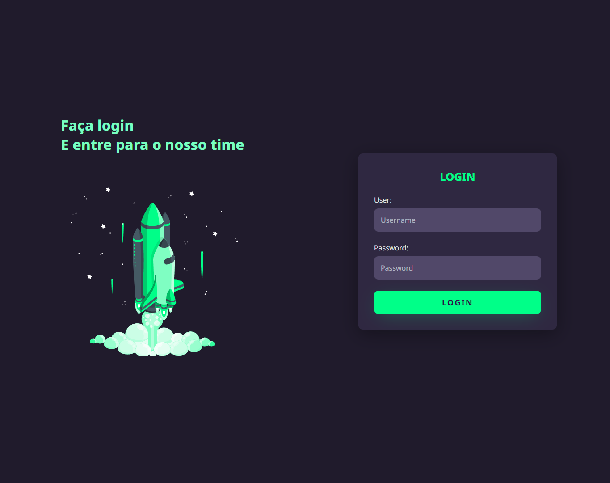
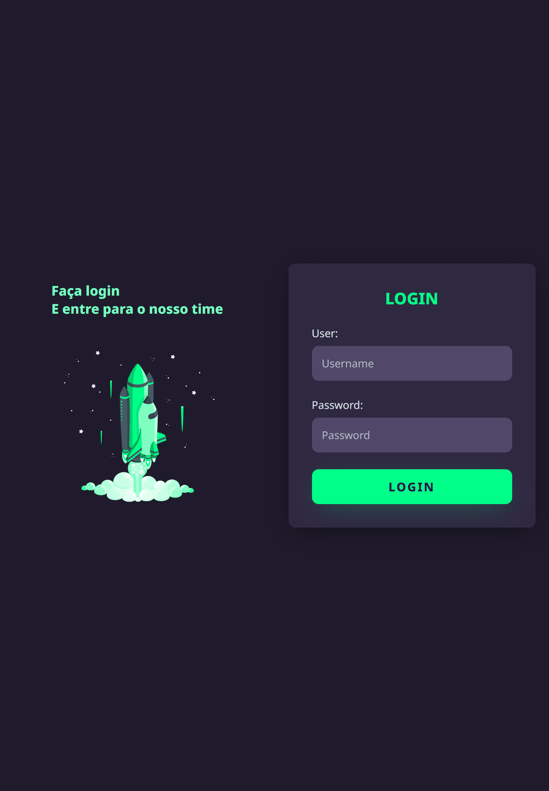
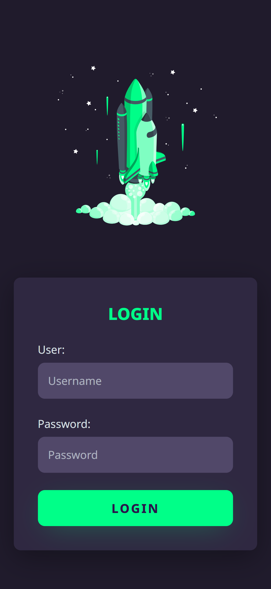

<h1 align="center"> Habits </h1>

  NLW é um evento exclusivo e gratuito, promovido pela Rocketseat para ensino de tecnologias WEB.  

  <a href="#-tecnologias">Tecnologias</a>&nbsp;&nbsp;&nbsp;|&nbsp;&nbsp;&nbsp;
  <a href="#-projeto">Projeto</a>&nbsp;&nbsp;&nbsp;|&nbsp;&nbsp;&nbsp;
  <a href="#memo-licença">Licença</a>

  

 

  
  
  

## 🚀 Tecnologias

Esse projeto foi desenvolvido com as seguintes tecnologias:

- HTML e CSS
- SCSS
- Git e Github

## 💻 Projeto

O Login Dark é um projeto para contribuir com os conhecimentos de responsividade e animação de imagens.

- [Visite o vídeo explicativo](https://www.youtube.com/watch?v=69-WfrVBli8&list=WL&index=310)

## :memo: Licença

Esse projeto está sob a licença MIT.

---

Feito com ♥ by FelipeCastro
